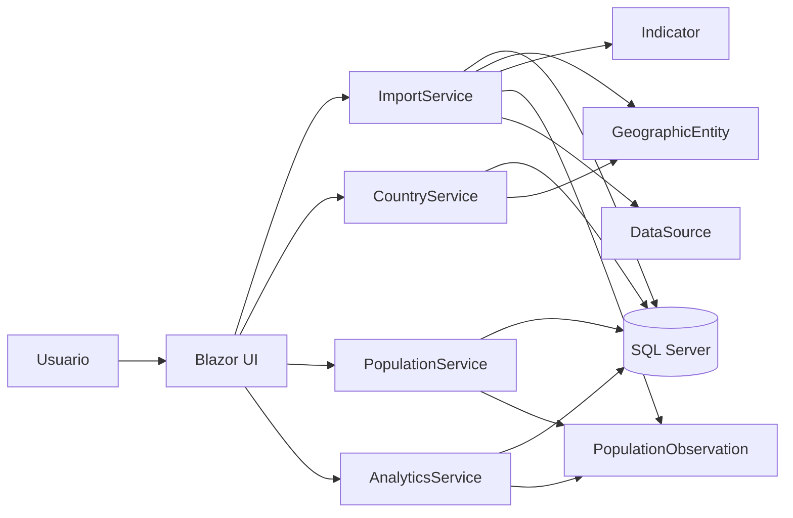

# Arquitectura general de la solución

```mermaid
graph LR
	U[Usuario] --> FE[Blazor UI]
	FE --> S1[ImportService]
	FE --> S2[CountryService]
	FE --> S3[PopulationService]
	FE --> S4[AnalyticsService]

	S1 --> DB[(SQL Server)]
	S2 --> DB
	S3 --> DB
	S4 --> DB

	S1 --> T1[GeographicEntity]
	S1 --> T2[Indicator]
	S1 --> T3[PopulationObservation]
	S1 --> T4[DataSource]

	S2 --> T1
	S3 --> T3
	S4 --> T3
```

## Nota
- El frontend consume servicios vía DI.
- La persistencia se realiza con EF Core (`CountriesDbContext`).
