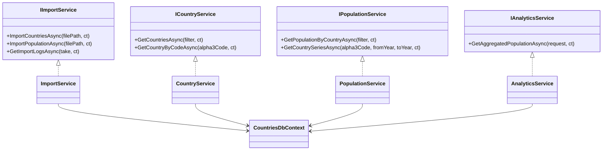

# Backend - servicios y responsabilidades

```mermaid
classDiagram
	class IImportService {
	  +ImportCountriesAsync(filePath, ct)
	  +ImportPopulationAsync(filePath, ct)
	  +GetImportLogsAsync(take, ct)
	}

	class ICountryService {
	  +GetCountriesAsync(filter, ct)
	  +GetCountryByCodeAsync(alpha3Code, ct)
	}

	class IPopulationService {
	  +GetPopulationByCountryAsync(filter, ct)
	  +GetCountrySeriesAsync(alpha3Code, fromYear, toYear, ct)
	}

	class IAnalyticsService {
	  +GetAggregatedPopulationAsync(request, ct)
	}

	class ImportService
	class CountryService
	class PopulationService
	class AnalyticsService
	class CountriesDbContext

	IImportService <|.. ImportService
	ICountryService <|.. CountryService
	IPopulationService <|.. PopulationService
	IAnalyticsService <|.. AnalyticsService

	ImportService --> CountriesDbContext
	CountryService --> CountriesDbContext
	PopulationService --> CountriesDbContext
	AnalyticsService --> CountriesDbContext
```
