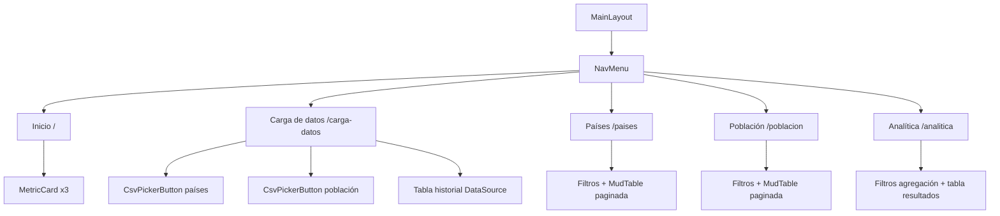

# Frontend - navegación principal

```mermaid
graph TD
	L[MainLayout] --> M[NavMenu]
	M --> P1[Inicio /]
	M --> P2[Carga de datos /carga-datos]
	M --> P3[Países /paises]
	M --> P4[Población /poblacion]
	M --> P5[Analítica /analitica]

	P1 --> C1[MetricCard x3]
	P2 --> C2[CsvPickerButton países]
	P2 --> C3[CsvPickerButton población]
	P2 --> C4[Tabla historial DataSource]
	P3 --> C5[Filtros + MudTable paginada]
	P4 --> C6[Filtros + MudTable paginada]
	P5 --> C7[Filtros agregación + tabla resultados]
```
