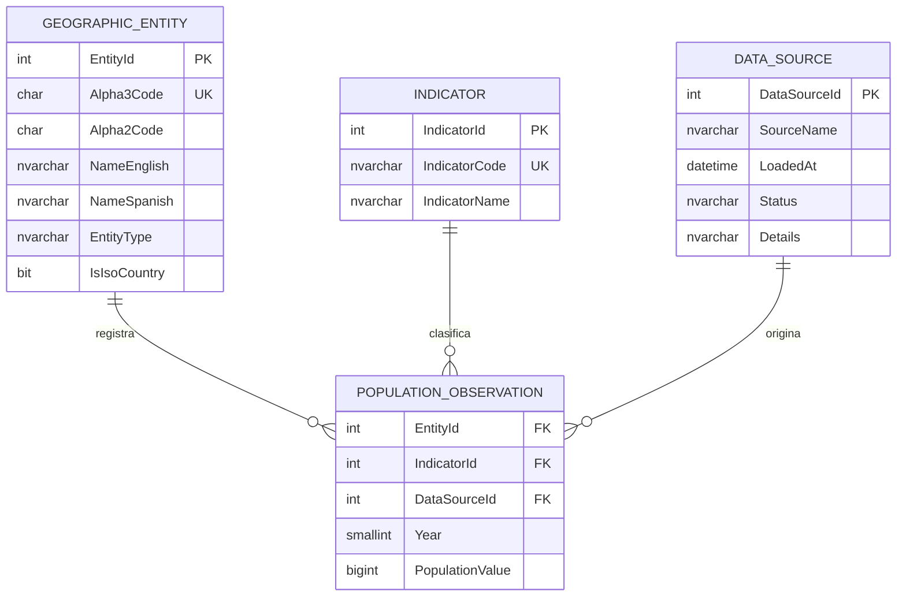

# Base de datos - modelo entidad relación

```mermaid
erDiagram
	GEOGRAPHIC_ENTITY ||--o{ POPULATION_OBSERVATION : registra
	INDICATOR ||--o{ POPULATION_OBSERVATION : clasifica
	DATA_SOURCE ||--o{ POPULATION_OBSERVATION : origina

	GEOGRAPHIC_ENTITY {
		int EntityId PK
		char Alpha3Code UK
		char Alpha2Code
		nvarchar NameEnglish
		nvarchar NameSpanish
		nvarchar EntityType
		bit IsIsoCountry
	}

	INDICATOR {
		int IndicatorId PK
		nvarchar IndicatorCode UK
		nvarchar IndicatorName
	}

	DATA_SOURCE {
		int DataSourceId PK
		nvarchar SourceName
		datetime LoadedAt
		nvarchar Status
		nvarchar Details
	}

	POPULATION_OBSERVATION {
		int EntityId FK
		int IndicatorId FK
		int DataSourceId FK
		smallint Year
		bigint PopulationValue
	}
```

## Restricción clave
- `POPULATION_OBSERVATION` es único por (`EntityId`, `IndicatorId`, `Year`).
