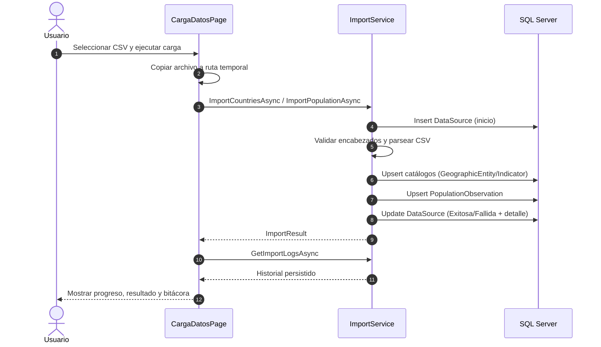

# Flujo de importación de CSV

```mermaid
sequenceDiagram
	autonumber
	actor U as Usuario
	participant UI as CargaDatosPage
	participant IS as ImportService
	participant DB as SQL Server

	U->>UI: Seleccionar CSV y ejecutar carga
	UI->>UI: Copiar archivo a ruta temporal
	UI->>IS: ImportCountriesAsync / ImportPopulationAsync

	IS->>DB: Insert DataSource (inicio)
	IS->>IS: Validar encabezados y parsear CSV
	IS->>DB: Upsert catálogos (GeographicEntity/Indicator)
	IS->>DB: Upsert PopulationObservation
	IS->>DB: Update DataSource (Exitosa/Fallida + detalle)

	IS-->>UI: ImportResult
	UI->>IS: GetImportLogsAsync
	IS-->>UI: Historial persistido
	UI-->>U: Mostrar progreso, resultado y bitácora
```
