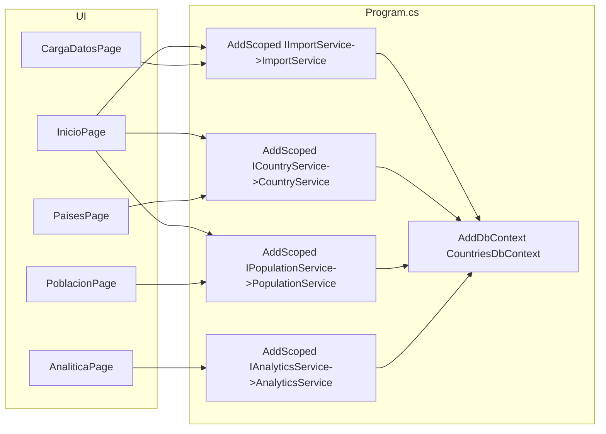

# Flujo de dependencias (DI)

```mermaid
graph LR
	subgraph Program.cs
	  R1[AddScoped IImportService->ImportService]
	  R2[AddScoped ICountryService->CountryService]
	  R3[AddScoped IPopulationService->PopulationService]
	  R4[AddScoped IAnalyticsService->AnalyticsService]
	  R5[AddDbContext CountriesDbContext]
	end

	subgraph UI
	  U1[InicioPage]
	  U2[CargaDatosPage]
	  U3[PaisesPage]
	  U4[PoblacionPage]
	  U5[AnaliticaPage]
	end

	U1 --> R2
	U1 --> R3
	U1 --> R1
	U2 --> R1
	U3 --> R2
	U4 --> R3
	U5 --> R4

	R1 --> R5
	R2 --> R5
	R3 --> R5
	R4 --> R5
```
