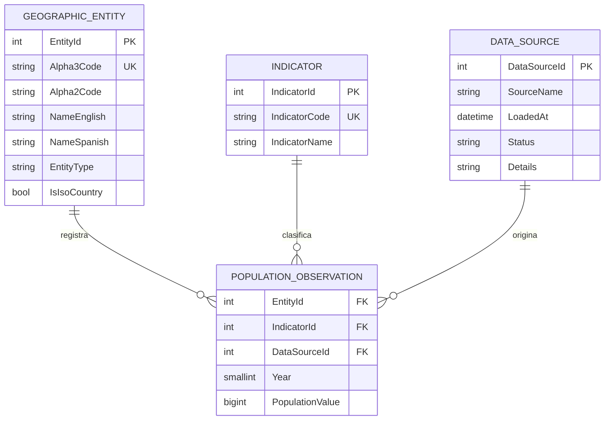

# Modelo Entidad-Relación (propuesto)

## Diagrama (Mermaid)

## Notas

- `POPULATION_OBSERVATION` debe tener unicidad por (`EntityId`, `IndicatorId`, `Year`).
- `DATA_SOURCE` es opcional pero recomendable para trazabilidad de cargas.
